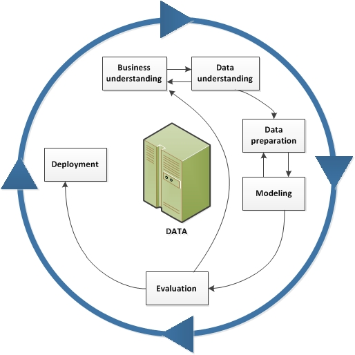

```{r setup, include=FALSE}
knitr::opts_chunk$set(echo = FALSE, comment = "")
library(shiny)
library(data.table)
library(kableExtra)
library(magrittr)
library(ggplot2)

# load Loans Data
loan_data <- read.csv("./Data/loan_data_preproc.csv", stringsAsFactors = TRUE)
setDT(loan_data)
# remove index column inserted by Excel
loan_data[, X := NULL]
# Select required variables
loan_data <- loan_data[, .(loan_status, loan_amnt, ir_cat, emp_cat)]
# Convert response to categorical in order to 
# identify with names when plotting
loan_data$loan_status <-ifelse(loan_data$loan_status ==1, 
                               "Default!",
                               "Loan Paid") %>% 
  as.factor() %>% 
  relevel(ref = "Loan Paid")
```

# Comparison Between Loans in Default and Repaid  

{#right width="10%"}

:::: {style="display: grid; grid-template-columns: 400px 600px;"} 

::: {}

-    Analysis Methodology: 

[Crisp DM](https://www.ibm.com/docs/en/spss-modeler/18.2.2?topic=dm-crisp-help-overview#crisp_overview) 

-    Business Understanding: Lending

> "I sincerely believe that ... the principle of spending money to be paid by posterity, under the name of funding, is but swindling futurity on a large scale."\
> Thomas Jefferson

:::

::: {}

{width=75%}

:::

::::

# Data Understanding
{#right width="10%"}

-   Simulated credit bureau data

:::: {style="display: flex;"} 

::: {}

[Credit Risk Dataset](https://www.kaggle.com/laotse/credit-risk-dataset)

{width="20%"}

:::

::: {}
-   Features:  

| Applicant                               | Financials             |
|-----------------------------------------|------------------------|
| Income                                  | Loan Grade             |
| Home Ownership                          | Loan Amount            |
| Employment Category                     | Loan Percent Income    |
| Credit bureau report has default info   | Interest Rate Category |

-    Target Variable

        -   Loan Status
```{r}
cat("Total number of loan instances: ", nrow(loan_data))
```

:::

::::

# Data Preparation 

{#right width="10%"}

-    Transformed continuous variables to categorical  

        -   employment history  
        -   interest rate  


-   Modeling: Classification

    -   Default
    -   Repaid
    
```{r}
ir <- "0-8"
emp <- "0-15"
subset_data <- loan_data[ ir_cat == ir &
                                emp_cat == emp]
head(subset_data) %>% 
  kable() %>% 
  kable_styling()
```


# Evaluation

{#right width="10%"}

-   Web App  

    -   Select input features

```{r}
fluidPage(
  sidebarPanel(
    selectInput('ir', label = 'Interest Rate: ', 
                choices = levels(loan_data$ir_cat)),
    selectInput('emp', label = 'Employment Length: ', 
                choices = levels(loan_data$emp_cat)) 
  )
)

```

-    Web App

     -   Subset Data
    
```{r}
cat("number of instances in subset data: ", nrow(subset_data))
```
    
# Evaluation

{#right width="10%"}

-   Web App  

    - Range of instances in each class
    
```{r}
ggplot(subset_data, aes(y = loan_amnt, x = loan_status,
                            color = loan_status) ) +
      geom_boxplot() +
      coord_flip() +
      # Use brewer color palettes
      scale_color_brewer(palette="Dark2") +
      theme(legend.position="none") +
      labs(title="Repayment",x="Loan Outcome", y = "Loan Amount")
```

